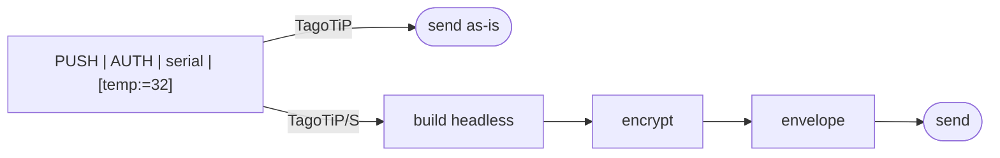
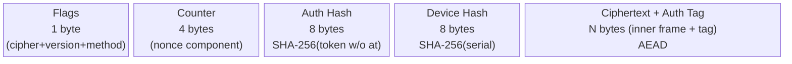
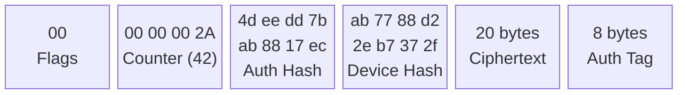

<!--
  Copyright 2026 TagoIO Inc.

  Licensed under the Apache License, Version 2.0 (the "License");
  you may not use this file except in compliance with the License.
  You may obtain a copy of the License at

      http://www.apache.org/licenses/LICENSE-2.0

  Unless required by applicable law or agreed to in writing, software
  distributed under the License is distributed on an "AS IS" BASIS,
  WITHOUT WARRANTIES OR CONDITIONS OF ANY KIND, either express or implied.
  See the License for the specific language governing permissions and
  limitations under the License.
-->

# TagoTiP/S — Secure Crypto Envelope

**Version:** 1.0 (Draft)
**Date:** February 2026
**Status:** Draft Specification — Revision C

> TagoTiP/S wraps TagoTiP data in a binary envelope. For the plaintext frame format (methods, variable syntax, parsing), see [TagoTiP.md](TagoTiP.md).

---

## 1. Introduction

TagoTiP/S (Secure) is a binary crypto envelope that provides **AEAD authenticated encryption** for TagoTiP data without requiring TLS. It is designed for links where TLS is unavailable or too expensive — such as LoRa, Sigfox, NB-IoT, or raw UDP.

TagoTiP/S uses a compact **headless inner frame** that omits fields carried by the envelope header, saving ~40–50 bytes per message (see §4).

### 1.1 How It Works



### 1.2 Envelope at a Glance



> 21 bytes header + ciphertext + auth tag

### 1.3 Design Goals

- **Encrypted** — AEAD authenticated encryption (configurable cipher suite) for links where TLS is unavailable
- **Integrity-verified** — built-in authentication tag detects tampering or corruption
- **Compact** — 29–37 bytes of envelope overhead (depending on cipher suite)
- **Transport-agnostic** — works over UDP, TCP, HTTP(S), MQTT, or any byte-capable channel
- **C-friendly** — predictable buffer sizes, no dynamic allocation required

---

## 2. Credentials

TagoTiP/S uses the following credentials for envelope construction and processing.

| Credential | Format | Secrecy | Purpose |
|---|---|---|---|
| **Authorization Token** | `at` + 32 hex chars (34 chars total) | Secret | Identifies the Account/Profile. Used to derive the Authorization Hash. Never transmitted on the wire. |
| **Authorization Hash** | 8 bytes (derived) | Public | First 8 bytes of SHA-256 of the Authorization Token **without the `at` prefix** (UTF-8 encoded). Used as the **profile identifier** in the envelope header and in TagoTiP frames. Safe to display in UIs/logs. |
| **Device Hash** | 8 bytes (derived) | Public | First 8 bytes of SHA-256 of the device serial number (UTF-8 encoded). Used as the **device identifier** in the envelope header. Allows the server to identify the device before decryption. |
| **Encryption Key** | 16 or 32 bytes (depends on cipher suite) | Secret | AEAD key used to encrypt/decrypt frames. Scoped **per-device** — each device has its own key. Looked up by the combination of Authorization Hash and Device Hash. |

Encryption Keys MUST be unique per device within a profile. Key reuse across devices is a configuration error and may compromise nonce uniqueness. Key length (16 or 32 bytes) is determined by the cipher suite (see §3.1). Changing to a cipher suite with a different key length requires reprovisioning the Encryption Key.

### 2.1 Deriving the Authorization Hash

Given an Authorization Token `ate2bd319014b24e0a8aca9f00aea4c0d0`:

1. Strip the `at` prefix: `e2bd319014b24e0a8aca9f00aea4c0d0`
2. Encode the hex string as UTF-8 bytes
3. Compute SHA-256 of those bytes
4. Take the first 8 bytes of the digest: `0x4d 0xee 0xdd 0x7b 0xab 0x88 0x17 0xec`

> **Note:** The Authorization Hash derivation is shared between TagoTiP and TagoTiP/S. See [TagoTiP.md §2](TagoTiP.md#2-credentials) for the same computation.

### 2.2 Deriving the Device Hash

Given a device serial `sensor-01`:

1. Compute SHA-256 of the UTF-8 bytes of `sensor-01`
2. Take the first 8 bytes of the digest (e.g., `0xab 0x77 0x88 0xd2 0x2e 0xb7 0x37 0x2f`)

> **Note:** With an 8-byte hash (2^64 space), collisions within a single profile are virtually impossible in practice. If multiple devices nonetheless share the same Device Hash within a profile, the server SHOULD attempt decryption with each matching device's key until one succeeds or all fail. If all decryption attempts fail, the server MUST respond with `ACK|ERR|auth_failed`.

### 2.3 Provisioning (Non-Normative)

The Encryption Key and Authorization Token SHOULD be provisioned during manufacturing or via a secure out-of-band channel. The protocol does not define a key exchange mechanism. The cipher suite SHOULD also be agreed upon during provisioning. The protocol does not include an in-band cipher negotiation mechanism; both sides must be configured to use the same cipher suite for a given device.

### 2.4 Optional Key Derivation (HMAC-SHA256)

Implementations MAY derive the Encryption Key from the Authorization Token and device serial number using HMAC-SHA256 instead of provisioning a separate key. This is a convenience feature — pre-provisioned keys remain fully supported and are the default.

**Construction:**

```
derive_key(token, serial, key_len):
  1. hex_part  = strip "at" prefix from token (if present)
  2. hmac_key  = UTF-8 bytes of hex_part
  3. message   = UTF-8 bytes of serial
  4. output    = HMAC-SHA256(key=hmac_key, msg=message)   // 32 bytes
  5. return    output[0..key_len]
```

- `key_len` = 16 for AES-128 cipher suites, 32 for AES-256 / ChaCha20-Poly1305
- HMAC-SHA256 requires only SHA-256 (already required by §2.1 and §2.2) plus the HMAC wrapper (RFC 2104)
- The token hex part is the HMAC key (secret); the serial is the message (semi-public). This is safe because HMAC security depends on the key being secret, not the message
- SHA-256 output is 32 bytes, covering all cipher suite key sizes

**Test vector** (using the spec credentials from §11.1):

```
Token:   ate2bd319014b24e0a8aca9f00aea4c0d0
Serial:  sensor-01

HMAC key (UTF-8):  "e2bd319014b24e0a8aca9f00aea4c0d0"
HMAC message (UTF-8): "sensor-01"

Derived key (32 bytes):
  e5 05 f0 3c c9 e9 3f db cc 38 28 44 cc a3 e1 7f
  df 0b b3 13 18 58 53 95 ce aa a3 9a 5d 14 19 64

First 16 bytes (AES-128): e5 05 f0 3c c9 e9 3f db cc 38 28 44 cc a3 e1 7f
```

> **Note:** When using derived keys, the Authorization Token becomes the sole secret for a given device. Implementations using key derivation MUST treat the token with the same care as an Encryption Key.

### 2.5 Hex Utilities (Non-Normative)

SDK implementations SHOULD provide `hex_to_bytes` and `bytes_to_hex` utility functions to simplify working with pre-provisioned keys supplied as hex strings. These are not protocol-level operations but are commonly needed by integrators.

---

## 3. Security Primitives

### 3.1 Encryption

TagoTiP/S supports multiple AEAD cipher suites. The cipher suite is encoded in bits 7–5 of the Flags byte (see §5.1).

| ID | Name | Key | Tag | Nonce | L |
|----|------|-----|-----|-------|---|
| 0 | AES-128-CCM | 16 B | 8 B | 13 B | 2 |
| 1 | AES-128-GCM | 16 B | 16 B | 12 B | — |
| 2 | AES-256-CCM | 32 B | 8 B | 13 B | 2 |
| 3 | AES-256-GCM | 32 B | 16 B | 12 B | — |
| 4 | ChaCha20-Poly1305 | 32 B | 16 B | 12 B | — |
| 5–7 | Reserved | — | — | — | — |

> **L** is the CCM length-field size parameter (in bytes). For CCM suites the nonce length is 15 − L; with L = 2 the nonce is 13 bytes and the maximum plaintext size is 2^16 − 1 bytes (64 KiB). The L column is not applicable ("—") to non-CCM cipher suites.

All implementations MUST support cipher suite 0 (AES-128-CCM). Support for additional cipher suites is OPTIONAL but RECOMMENDED for deployments with higher security requirements.

The device's **Encryption Key** (pre-provisioned, never transmitted) must match the key size required by the selected cipher suite.

### 3.2 Authentication Tag

The authentication tag is produced automatically by the AEAD cipher during encryption. Its length depends on the cipher suite: **8 bytes** for CCM suites, **16 bytes** for GCM and ChaCha20-Poly1305. The tag covers both the plaintext (the headless inner frame) and the Associated Authenticated Data (AAD = envelope header, bytes 0–20). There is no separate hash computation.

### 3.3 Nonce

The protocol uses a bandwidth-efficient nonce derived from the counter and device hash fields in the envelope header. The nonce length depends on the cipher suite:

- **13 bytes** for CCM suites (L=2, nonce = 15 − L)
- **12 bytes** for GCM and ChaCha20-Poly1305 suites

The full nonce is never transmitted.

**Components:**

- **Counter:** The 4-byte value from the envelope header (Big-Endian).
- **Device Hash:** The first 4 bytes of the 8-byte Device Hash from the envelope header.

**Construction (13-byte nonce — CCM suites):**

```
[Flags (1 byte)] [00 00 00 00] [Device Hash (4 bytes)] [Counter (4 bytes)]
```

**Construction (12-byte nonce — GCM / ChaCha20-Poly1305 suites):**

```
[Flags (1 byte)] [00 00 00] [Device Hash (4 bytes)] [Counter (4 bytes)]
```

For cipher suites with a 12-byte nonce, the zero-padding is 3 bytes instead of 4.

**Transmission:** The 4-byte counter and 8-byte Device Hash are sent in the envelope header. The receiver reconstructs the full nonce using the Flags byte (byte 0 of the envelope), the first 4 bytes of the Device Hash, Counter, and the nonce length from the cipher suite table.

Including the Flags byte in the nonce ensures uniqueness across message directions and cipher suites: different cipher/method combinations in the Flags byte occupy distinct nonce spaces, preventing nonce reuse even when the counter values coincide. The Device Hash component further guarantees uniqueness across devices that share the same encryption key.

---

## 4. Headless Inner Frame

TagoTiP/S does not encrypt a complete TagoTiP frame. Instead, it uses a compact **headless inner frame** that omits fields already carried by the envelope header:

| Field | In plaintext TagoTiP frame | In TagoTiP/S headless inner frame |
|---|---|---|
| **METHOD** | Inside frame (`PUSH\|...`) | **Flags byte** in envelope header |
| **AUTH** | Inside frame (34 bytes) | **Omitted** — Auth Hash in header identifies the profile |
| **!N** (counter) | Inside frame (optional) | **Omitted** — Counter field in header is authoritative |
| **SERIAL** | Inside frame | Inside frame (encrypted for device privacy) |
| **BODY** | Inside frame | Inside frame (encrypted) |

The Device Hash in the envelope header is an 8-byte routing hint derived from the serial. The full SERIAL stays inside the encrypted payload so that the actual device identity remains confidential.

### 4.1 Uplink Inner Frame Formats

| Method (in Flags byte) | Inner Frame | Example |
|---|---|---|
| PUSH (`0x0`) | `SERIAL\|BODY` | `sensor-01\|[temp:=32]` |
| PULL (`0x1`) | `SERIAL\|[VARNAME;...]` | `sensor-01\|[temperature]` |
| PING (`0x2`) | `SERIAL` | `sensor-01` |

The BODY follows the same syntax as in plaintext TagoTiP (structured variables, passthrough, etc.) — only the frame-level fields (method, auth, counter) are removed.

### 4.2 Downlink Inner Frame Formats

| Method (in Flags byte) | Inner Frame | Example |
|---|---|---|
| ACK (`0x3`) | `STATUS[\|DETAIL]` | `OK\|3`, `OK\|[temperature:=32#F@1694567890000]` (PULL), `CMD\|ota=https://example.com/v2.1.bin`, or `PONG` |

The `ACK|` prefix from plaintext TagoTiP is not present — the method is encoded in the Flags byte. The inner frame starts directly with the STATUS field.

---

## 5. Envelope Structure

The envelope is a single binary message constructed by concatenating the following components with no delimiters:

```
[Flags] + [Counter] + [Authorization Hash] + [Device Hash] + [Ciphertext + Auth Tag]
```

| Component | Size | Description |
|---|---|---|
| **Flags** | 1 byte | Cipher (bits 7–5), Version (bits 4–3), and Method (bits 2–0). See §5.1. |
| **Counter** | 4 bytes | Sequence counter or random nonce (Big-Endian). Used to derive the AEAD nonce. |
| **Authorization Hash** | 8 bytes | First 8 bytes of SHA-256 of the Authorization Token without the `at` prefix (UTF-8 encoded). Used by the server to identify the profile and look up the Encryption Key. |
| **Device Hash** | 8 bytes | First 8 bytes of SHA-256 of the device serial number (UTF-8 encoded). Used by the server to identify the device before decryption. The first 4 bytes are also incorporated into the nonce to prevent nonce collisions across devices. |
| **Ciphertext + Auth Tag** | Variable | AEAD-encrypted headless inner frame (see §4) followed by the authentication tag. Cipher suite selected by Flags byte. |

**Total overhead:** 29–37 bytes, depending on cipher suite. Formula: `21 (header) + tag_length` where tag_length is 8 bytes for CCM suites or 16 bytes for GCM / ChaCha20-Poly1305. No padding is required.

**Associated Authenticated Data (AAD):** The first 21 bytes of the envelope (Flags + Counter + Authorization Hash + Device Hash) are passed as AAD to the AEAD cipher. This means the header is integrity-protected but not encrypted — an attacker cannot modify any header field without causing authentication failure during decryption.

### 5.1 Flags Byte

The first byte of the envelope encodes the cipher suite, protocol version, and method:

```
Bit 7  6  5  4  3  2  1  0
    └─Cipher──┘  └Ver─┘  └Method─┘
```

| Field | Bits | Values |
|---|---|---|
| **Cipher** | 7–5 | Cipher suite ID — see the cipher suite table in §3.1. |
| **Version** | 4–3 | `0` = current version. `1`–`3` reserved for future versions. |
| **Method** | 2–0 | `0` = PUSH, `1` = PULL, `2` = PING, `3` = ACK. `4`–`7` reserved. |

**Examples:**

| Flags byte | Hex | Meaning |
|---|---|---|
| `000 00 000` | `0x00` | AES-128-CCM, Version 0, PUSH |
| `000 00 001` | `0x01` | AES-128-CCM, Version 0, PULL |
| `000 00 010` | `0x02` | AES-128-CCM, Version 0, PING |
| `000 00 011` | `0x03` | AES-128-CCM, Version 0, ACK |
| `100 00 000` | `0x80` | ChaCha20-Poly1305, Version 0, PUSH |

Receivers MUST reject envelopes with an unsupported version number or unsupported cipher suite.

> **Note:** The Flags byte value `0x41` (`010 00 001`) corresponds to cipher 2 (AES-256-CCM), version 0, PULL. This value is reserved for framing disambiguation (see §5.4) and MUST NOT appear as a valid Flags byte. Implementations using AES-256-CCM with PULL MUST use version ≥ 1 (i.e., `010 01 001` = `0x49`) or use a different cipher suite.

### 5.2 Byte Map Example

For a PUSH with serial `sensor-01` and body `[temp:=32]`, the headless inner frame is `sensor-01|[temp:=32]` (20 bytes):



> Header (AAD) = Flags + Counter + Auth Hash + Device Hash (first 21 bytes)

| Field | Bytes | Description |
|---|---|---|
| Flags | `00` (= cipher 0 AES-128-CCM, v0, PUSH) | Cipher, version, and method |
| Counter | `00 00 00 2A` (= 42) | Nonce component |
| Auth Hash | `4d ee dd 7b ab 88 17 ec` | SHA-256(token without "at"), first 8 bytes |
| Device Hash | `ab 77 88 d2 2e b7 37 2f` | SHA-256(serial), first 8 bytes |
| Ciphertext | 20 bytes | Headless inner frame, encrypted |
| Auth Tag | 8 bytes | CCM authentication tag |

Total envelope: 1 + 4 + 8 + 8 + 20 + 8 = **49 bytes**.

### 5.3 Transport Notes

| Transport | Framing | Notes |
|---|---|---|
| UDP | End of datagram | One envelope per datagram. |
| HTTP(S) | HTTP body | One envelope per request body. |
| MQTT | MQTT payload | One envelope per MQTT message. |
| TCP | Length-prefixed (see below) | Binary envelopes cannot use `\n` as a delimiter. |

On all transports, the receiver distinguishes plaintext fallback frames from TagoTiP/S envelopes by inspecting the first byte of the message: `0x41` (ASCII `A`) indicates a plaintext ACK frame (e.g., `ACK|ERR|auth_failed`); any other value indicates a TagoTiP/S envelope. The only plaintext frames that can appear on a TagoTiP/S connection are server-side ACK error fallbacks (see §9), so reserving `0x41` alone is sufficient for disambiguation.

### 5.4 Framing on Stream Transports (TCP)

The TagoTiP/S envelope is **binary** and may contain any byte value (including `0x0A`). Therefore, newline (`\n`) MUST NOT be used as a delimiter for TagoTiP/S on stream transports.

When carrying TagoTiP/S over TCP (or any stream transport), **all messages** MUST be framed using a length prefix:

```
[Length (uint16, Big-Endian)] + [Message bytes...]
```

Where `Length` is the number of bytes in the following message (not including the length field). This applies to both TagoTiP/S envelopes and plaintext fallback frames (e.g., `ACK|ERR|auth_failed`).

The receiver distinguishes between envelope and plaintext by inspecting the first byte of the message content: if the first byte of the message content is `0x41` (ASCII `A`), it is a plaintext ACK fallback frame; otherwise it is a TagoTiP/S envelope. The byte value `0x41` is reserved and MUST NOT be used as a Flags byte in any future protocol version.

### 5.5 Size Limits

- **Max raw inner frame size inside TagoTiP/S:** The unencrypted headless inner frame MUST NOT exceed **16,384 bytes**.
- **Max TagoTiP/S envelope size:** With the envelope overhead of `21 (header) + tag_length` bytes, the server MUST reject any envelope larger than **16,384 + 21 + tag_length** bytes (16,413 for CCM suites with 8-byte tag; 16,421 for GCM/ChaCha20 suites with 16-byte tag).

Field-level limits (variable name length, metadata pair count, etc.) are defined in [TagoTiP.md §4.5.1](TagoTiP.md#451-field-level-limits) and apply equally to headless inner frames.

---

## 6. Payload Construction Steps

1. **Build the headless inner frame.** Omit method, auth, and counter — only serial and body (for uplink). For example, a PUSH:
   ```
   sensor-01|[temperature:=32;humidity:=65]
   ```
2. **Compute the Device Hash.** SHA-256 the device serial number (UTF-8 bytes); keep the first 8 bytes.
3. **Build the Flags byte.** Cipher (bits 7–5) + Version (bits 4–3) + Method (bits 2–0). For example, AES-128-CCM PUSH version 0 = `0x00`.
4. **Build the envelope header (AAD).** Concatenate: `[Flags (1B)] + [Counter (4B)] + [Authorization Hash (8B)] + [Device Hash (8B)]` — 21 bytes total.
5. **Construct the nonce.** Length depends on cipher suite (see §3.3): 13 bytes for CCM, 12 bytes for GCM/ChaCha20. `[Flags (1B)] [zero-padding] [Device Hash[:4] (4B)] [Counter (4B)]`. Only the first 4 bytes of the Device Hash are used in the nonce.
6. **Encrypt.** Use the AEAD cipher indicated by the Flags byte with the Encryption Key, nonce, plaintext = headless inner frame bytes, and AAD = the 21-byte header. The cipher produces the ciphertext (same length as plaintext) and the authentication tag.
7. **Assemble the envelope.** Concatenate: `[Header (21B)] + [Ciphertext (NB)] + [Auth Tag]`.

---

## 7. Decryption Steps

When the receiver processes a TagoTiP/S envelope:

1. **Read Flags byte** (byte 0). Extract cipher (bits 7–5), version (bits 4–3), and method (bits 2–0). Reject if version is unsupported or cipher suite is unsupported.
2. **Parse header.** Read Counter (bytes 1–4), Authorization Hash (bytes 5–12), Device Hash (bytes 13–20). Use the Authorization Hash to identify the profile and look up the Encryption Key.
3. **Extract ciphertext.** Bytes 21 through end = ciphertext + auth tag.
4. **Reconstruct the nonce.** Use the cipher suite to determine nonce length (see §3.3): `[Flags (1B)] [zero-padding] [Device Hash[:4] (4B)] [Counter (4B)]`. Only the first 4 bytes of the Device Hash are used in the nonce.
5. **Decrypt.** Use the AEAD cipher from the Flags byte with the Encryption Key, nonce, ciphertext + auth tag, and AAD = bytes 0–20 (the 21-byte header). The cipher verifies integrity automatically — if the authentication tag does not match, decryption fails. Discard the envelope on authentication failure.
6. **Parse headless inner frame.** Use the method from the Flags byte to determine the format. Inner-frame field splitting (e.g., `SERIAL|BODY`, `STATUS|DETAIL`) MUST respect the same escape sequences defined in TagoTiP §4.4.
   - **PUSH (0):** `SERIAL|BODY` — parse BODY as a push body (structured variables or passthrough)
   - **PULL (1):** `SERIAL|[VARNAME;...]` — parse bracket-wrapped variable name list
   - **PING (2):** `SERIAL` — no body
   - **ACK (3):** `STATUS[|DETAIL]` — parse as a downlink response

---

## 8. Sequence Counter in TagoTiP/S

The sequence counter serves a dual purpose in TagoTiP/S: **replay protection** and **nonce derivation** for AEAD encryption.

> For general counter rules (initial value, increment, wraparound, persistence), see [TagoTiP.md §10](TagoTiP.md#10-sequence-counter-optional).

### 8.1 Binary Representation

In the TagoTiP/S envelope, the counter is stored as a **4-byte Big-Endian unsigned integer** in bytes 1–4 of the envelope header.

| Decimal | Bytes (Big-Endian) |
|---|---|
| 42 | `0x0000002A` |
| 1000 | `0x000003E8` |

### 8.2 Counter as Nonce Component

The Counter field in the envelope header is the sole source of the sequence number for TagoTiP/S messages. The `!N` field from standard TagoTiP frames is not present in the headless inner frame.

### 8.3 Server-Side Validation

The server uses the Authorization Hash and Device Hash from the envelope header as routing hints to locate candidate devices and their Encryption Keys. After successful decryption, the server tracks the last-seen counter value per **resolved device identity** (not per the pre-decryption hash pair).

### 8.4 When the Counter Is Not Used

When the sequence counter is **not used**, the device MUST still provide a 4-byte value in the Counter field of the envelope. A random 4-byte nonce MAY be used as a last resort on devices without persistent storage, but this sacrifices replay protection and ordering guarantees. Devices with persistent storage MUST NOT use random nonces — they MUST use a monotonic counter. With a 32-bit random nonce, the birthday paradox yields approximately 50% collision probability after ~77,000 messages; deployments using random nonces SHOULD implement application-level safeguards to limit total message count per key.

---

## 9. Downlink (Server → Client)

Downlink frames use method ACK (`0x3`) in the Flags byte. If the uplink message was received as a TagoTiP/S envelope, the server MUST respond using TagoTiP/S on the same connection or session.

If the server cannot identify the profile or decrypt the envelope, it SHOULD respond with a plaintext `ACK|ERR|auth_failed` frame, since it cannot construct a valid TagoTiP/S response without the correct Encryption Key. If the envelope has an unsupported version, the server SHOULD respond with a plaintext `ACK|ERR|unsupported_version` frame. If the cipher suite is unsupported, the server SHOULD respond with a plaintext `ACK|ERR|unsupported_cipher` frame. If the envelope exceeds the size limits defined in §5.5, the server SHOULD respond with a plaintext `ACK|ERR|envelope_too_large` frame. On stream transports (TCP), these plaintext fallback frames MUST be length-prefixed per §5.4.

Note that replay counter rejection (when counter enforcement is enabled) occurs **after** successful decryption and device resolution (see §8.3), so the server responds with an encrypted `ACK|ERR|invalid_seq` envelope, not a plaintext fallback.

The headless inner frame for downlink is `STATUS|DETAIL` or just `STATUS` — the `ACK|` prefix from plaintext TagoTiP is not present (the method is in the Flags byte). See [TagoTiP.md §9](TagoTiP.md#9-ack--server-response) for status codes and semantics.

- The 4-byte Counter field is used only as a **nonce seed** for the AEAD cipher. It does **not** represent a server sequence counter in this version.
- The nonce seed MUST be unique within the lifetime of the current Encryption Key for a given (Authorization Hash, Device Hash) pair (e.g., by using a per-connection monotonic seed or a uniqueness-checked random value).
- The server SHOULD use a per-device monotonic counter for downlink nonce seeds, stored persistently or derived from a server-wide counter. Random nonce seeds are permitted but carry the same birthday-bound collision risk as uplink random nonces (~50% collision probability after ~77,000 messages per device per key — see §8.4 and §14). High-frequency downlink scenarios (e.g., command bursts) SHOULD use monotonic counters to avoid nonce reuse.
- Clients MUST NOT enforce monotonic ordering on downlink nonce seeds.

On a given TagoTiP/S connection or session, the client MUST NOT send a new uplink request until it has received the ACK response for the previous request (i.e., at most one outstanding request at a time). The server MUST preserve request-response ordering.

> **Note:** TagoTiP/S provides cryptographic integrity and confidentiality for downlink messages but does not provide replay protection at the envelope level. Applications that deliver state-changing commands (e.g., `CMD|unlock_door`) SHOULD implement application-level idempotency or command nonces.

> **Note:** The `!N` response correlation mechanism from plaintext TagoTiP (§9.5) does not apply to TagoTiP/S. The envelope's Counter field serves as a nonce seed for the AEAD cipher — the server MUST manage its own counter or nonce space for downlink envelopes independently of uplink counter values. Correlation is unnecessary on the constrained transports TagoTiP/S targets.

---

## 10. Passthrough over TagoTiP/S

When using TagoTiP/S with passthrough payloads (`>x` or `>b`), the server first unwraps the envelope (AEAD decryption automatically verifies integrity), then processes the resulting headless inner frame. If the body contains a passthrough payload, it is delivered to the payload parser the same way as in plaintext TagoTiP.

See [TagoTiP.md §6.5](TagoTiP.md#65-passthrough) for passthrough syntax details.

---

## 11. Examples

### 11.1 Encrypted Push — AES-128-CCM (Test Vector)

The following is a fully computed test vector. Implementations SHOULD verify their output matches these values byte-for-byte.

```
Inputs:
  Token:           ate2bd319014b24e0a8aca9f00aea4c0d0
  Serial:          sensor-01
  Encryption Key:  fe 09 da 81 bc 44 00 ee 12 ab 56 cd 78 ef 90 12
  Counter:         42
  Method:          PUSH
  Cipher Suite:    0 (AES-128-CCM)

Derived values:
  Auth Hash:       4d ee dd 7b ab 88 17 ec   (SHA-256(token without "at")[:8])
  Device Hash:     ab 77 88 d2 2e b7 37 2f   (SHA-256("sensor-01")[:8])
  Flags:           0x00                       (cipher 0, version 0, PUSH)

Headless inner frame (20 bytes):
  ASCII:  sensor-01|[temp:=32]
  Hex:    73 65 6e 73 6f 72 2d 30 31 7c 5b 74 65 6d 70 3a 3d 33 32 5d

AEAD parameters:
  Nonce (13B):     00 00 00 00 00 ab 77 88 d2 00 00 00 2a
                   (uses first 4 bytes of Device Hash)
  AAD (21B):       00 00 00 00 2a 4d ee dd 7b ab 88 17 ec ab 77 88 d2 2e b7 37 2f

Output:
  Ciphertext (20B): c8 c5 aa 56 d7 55 58 2b ac ea 13 bb 57 24 93 bb 8c b1 08 03
  Auth Tag (8B):    cf 82 6f db 83 3b 79 c6

Complete envelope (49 bytes):
  00 00 00 00 2a 4d ee dd 7b ab 88 17 ec ab 77 88
  d2 2e b7 37 2f c8 c5 aa 56 d7 55 58 2b ac ea 13
  bb 57 24 93 bb 8c b1 08 03 cf 82 6f db 83 3b 79
  c6

Breakdown: 1 (flags) + 4 (counter) + 8 (auth hash) + 8 (device hash) + 20 (ciphertext) + 8 (auth tag) = 49 bytes
```

> **Note:** This test vector uses a pre-provisioned Encryption Key. The derived key for these credentials (§2.4) would be `e5 05 f0 3c ...` — a different value, confirming that key derivation is optional.

### 11.2 Downlink with Command

```
Server has queued command for sensor-01.
Server wraps response in envelope using sensor-01's Device Hash, Flags = 0x03 (ACK),
and a unique nonce seed.

Headless inner frame:  CMD|ota=https://example.com/v2.1.bin
Device decrypts using its Encryption Key and the reconstructed nonce.
AEAD decryption verifies authenticity; device reads method=ACK from Flags,
parses STATUS=CMD, DETAIL=ota=https://example.com/v2.1.bin.
```

### 11.3 Encrypted Push — ChaCha20-Poly1305 (Conceptual)

```
Headless inner frame:  sensor-01|[temp:=32]   (20 bytes)
Counter:               1
Flags:                 0x80 (cipher 4 = ChaCha20-Poly1305, version 0, PUSH)
Auth Hash:             SHA-256("e2bd319014b24e0a8aca9f00aea4c0d0")[:8]
                       → 4deedd7bab8817ec (8 bytes)
Device Hash:           SHA-256("sensor-01")[:8] → 8 bytes (e.g., 0xab7788d22eb7372f)
Encryption Key:        32 bytes (pre-provisioned, ChaCha20 requires 256-bit key)

Step 1: Build Flags byte = 0x80 (cipher 4, version 0, PUSH)
Step 2: Build header (AAD) = [0x80] + [0x00000001] + [Auth Hash (8B)] + [Device Hash (8B)] → 21 bytes
Step 3: Nonce (12 bytes for ChaCha20) = 0x80 000000 ab7788d2 00000001
                                        ↑flags ↑ 3 zeros ↑ dev hash[:4] ↑ counter
Step 4: ChaCha20-Poly1305 encrypt (key, nonce, plaintext=20B inner frame, AAD=21B header)
        → 20 bytes ciphertext + 16 bytes auth tag
Step 5: Envelope = [Header (21B)] + [Ciphertext (20B)] + [Auth Tag (16B)]
Total: 1 + 4 + 8 + 8 + 20 + 16 = 57 bytes
```

---

## 12. Envelope Parsing

1. Read byte 0 as Flags. Extract cipher (bits 7–5), version (bits 4–3), and method (bits 2–0). Reject if version is unsupported, cipher suite is unsupported, or method is unknown.
2. Read bytes 1–4 as Counter (Big-Endian uint32)
3. Read bytes 5–12 as Authorization Hash
4. Read bytes 13–20 as Device Hash
5. Everything from byte 21 to end is the Ciphertext + Auth Tag
6. Look up the profile by Authorization Hash; retrieve the Encryption Key. Look up cipher suite parameters (key size, tag length, nonce length) from §3.1.
7. Identify candidate device(s) by (Authorization Hash, Device Hash) pair. Multiple devices may share the same Device Hash (see §2.2).
8. Reconstruct the nonce using the cipher suite's nonce length (see §3.3): `[Flags] [zero-padding] [Device Hash[:4]] [Counter]`. Only the first 4 bytes of the Device Hash are used in the nonce.
9. Decrypt with the cipher suite's AEAD algorithm using the Encryption Key, nonce, ciphertext + auth tag, and AAD = bytes 0–20 (the 21-byte header). The cipher verifies integrity automatically. If authentication fails and multiple candidate devices were identified in step 7, retry decryption with the next candidate's Encryption Key. If all candidates fail, discard the envelope and respond with `ACK|ERR|auth_failed`.
10. Verify that the SERIAL in the decrypted inner frame matches the device associated with the Encryption Key used for decryption. Reject the envelope if the SERIAL does not match.
11. Parse the decrypted data as a headless inner frame using the method from the Flags byte (see §4)

---

## 13. Size Comparison

| Format | Approximate Size | vs. HTTP/JSON |
|---|---|---|
| HTTP/JSON | ~487 bytes | — |
| TagoTiP | ~112 bytes | ~4.3× smaller |
| **TagoTiP/S** | **~119 bytes** | **~4.1× smaller** |

Example breakdown for a 112-byte TagoTiP frame:

```
Full TagoTiP frame (112 bytes):
  PUSH|4deedd7bab8817ec|sensor-01|^batch_42@1694567890000[temperature:=32#F;position@=39.74,-104.99{source=dht22}]

Headless inner frame (90 bytes):
  sensor-01|^batch_42@1694567890000[temperature:=32#F;position@=39.74,-104.99{source=dht22}]
  (removed "PUSH|4deedd7bab8817ec|" = 22 bytes)

Envelope (AES-128-CCM): 1 (flags) + 4 (counter) + 8 (auth hash) + 8 (device hash) + 90 (ciphertext) + 8 (auth tag) = 119 bytes
Envelope (GCM/ChaCha20): 1 + 4 + 8 + 8 + 90 + 16 (auth tag) = 127 bytes
```

> **Note:** 29 bytes overhead with AES-128-CCM (8B tag), 37 bytes with GCM or ChaCha20-Poly1305 (16B tag).

---

## 14. Security Considerations

### 14.0 Threat Model

TagoTiP/S is designed to protect constrained IoT links against **passive eavesdropping**, **active message tampering**, and **replay attacks**. The following are explicitly **out of scope**: key exchange and PKI (keys are provisioned out-of-band), denial-of-service at the transport level, and side-channel attacks on endpoint implementations. The protocol assumes that the Encryption Key has been securely provisioned via an out-of-band mechanism (see §2.3) and that endpoint devices can perform AEAD operations correctly.

- The Encryption Key MUST be provisioned securely (e.g., during manufacturing or via a secure provisioning channel)
- The Encryption Key MUST NOT be transmitted over the wire
- The Authorization Hash is a truncated SHA-256 of the Authorization Token (without the `at` prefix). Because SHA-256 is preimage-resistant, the hash does not leak any bits of the original token. The Device Hash (first 8 bytes of SHA-256 of serial) is similarly protected. Neither hash compromises the Encryption Key
- All supported cipher suites provide **authenticated encryption** (AEAD) — confidentiality and integrity in a single primitive. The authentication tag protects both the plaintext and the envelope header (via AAD). Tag length is 8 bytes for CCM suites and 16 bytes for GCM/ChaCha20-Poly1305 suites
- The AAD mechanism protects envelope header integrity. An attacker cannot modify the Flags, Counter, Authorization Hash, or Device Hash fields without causing authentication failure
- **Cipher suite downgrade protection:** The cipher suite is encoded in the Flags byte, which is integrity-protected via AAD. An attacker cannot downgrade the cipher suite without causing authentication failure
- The nonce is constructed as `[Flags (1B)] [zero-padding] [Device Hash[:4] (4B)] [Counter (4B)]` (see §3.3 for length), using the first 4 bytes of the 8-byte Device Hash from the header. Including the Flags byte ensures that different cipher/method combinations produce distinct nonces even when the counter values coincide, preventing nonce reuse across directions and cipher suites. The Device Hash component ensures uniqueness per device even when multiple devices share the same encryption key and profile. When using a monotonic counter, the 4-byte counter field provides 2^32 unique nonces per device per direction; devices MUST re-provision before counter exhaustion. When using a random nonce (§8.4), nonce uniqueness is not guaranteed — the birthday paradox yields approximately 50% collision probability after ~77,000 messages. Devices with persistent storage MUST use a monotonic counter (see §8.4). Monotonic counters are RECOMMENDED for TagoTiP/S.
- The server SHOULD reject messages with a counter value ≤ the last accepted value to prevent replay attacks (when sequence counter enforcement is enabled)
- The Flags byte exposes the cipher suite, version, and method (PUSH, PULL, PING, or ACK) in the unencrypted header. This reveals the cipher in use and whether a device is sending data, requesting data, or performing a keepalive. However, the method is already largely inferrable from message direction (uplink vs. downlink) and envelope size in practice. The Flags byte is integrity-protected via AAD, preventing an attacker from altering the cipher suite, version, or method without detection.

### 14.1 Key Rotation (Non-Normative)

Key rotation is supported without protocol changes. When a device's Encryption Key is rotated, the server simply trial-decrypts with both old and new keys — the same mechanism used for Device Hash collisions (see §2.2 and §12 step 9).

A dedicated Key Epoch header field was considered and intentionally omitted:

- Trial decryption with 2 candidate keys is computationally cheap (microseconds on modern hardware)
- Adding 1 byte per message for a rare operation (key rotation) is a poor tradeoff for constrained links
- The collision-resolution mechanism in §12 step 9 already handles this case naturally

Implementations SHOULD support a configurable key rotation window (e.g., accept both old and new keys for a grace period after rotation). After the grace period, the server SHOULD remove the old key to reduce trial-decryption candidates.

### 14.2 Key Derivation Trade-offs (Non-Normative)

When using optional key derivation (§2.4), the Authorization Token becomes the sole secret for all devices in a profile. Compromising the token allows deriving Encryption Keys for every device that uses derived keys under that profile. Pre-provisioned keys provide per-device isolation — compromising one device's key does not affect others.

Deployments requiring per-device key isolation SHOULD use pre-provisioned keys.

---

## 15. License

This specification is **open source**, published under the [Apache License 2.0](LICENSE).

Anyone is free to implement TagoTiP/S — clients, servers, libraries, gateways, or any other component — for any purpose, including commercial use, without requiring permission from TagoIO Inc. The Apache 2.0 license includes an express patent grant to all implementers.

The names "TagoTiP", "TagoTiP/S", and "TagoIO" are trademarks of TagoIO Inc. See [NOTICE](NOTICE) for trademark details.

Copyright 2026 TagoIO Inc.
