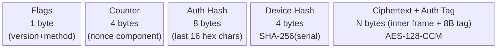
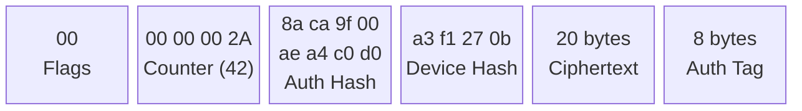

<!--
  Copyright 2026 TagoIO Inc.

  Licensed under the Apache License, Version 2.0 (the "License");
  you may not use this file except in compliance with the License.
  You may obtain a copy of the License at

      http://www.apache.org/licenses/LICENSE-2.0

  Unless required by applicable law or agreed to in writing, software
  distributed under the License is distributed on an "AS IS" BASIS,
  WITHOUT WARRANTIES OR CONDITIONS OF ANY KIND, either express or implied.
  See the License for the specific language governing permissions and
  limitations under the License.
-->

# TagoTiP/S — Secure Crypto Envelope

**Version:** 1.0 (Draft)
**Date:** February 2026
**Status:** Draft Specification — Revision C

> TagoTiP/S wraps TagoTiP data in a binary envelope. For the plaintext frame format (methods, variable syntax, parsing), see [TagoTiP.md](TagoTiP.md).

---

## 1. Introduction

TagoTiP/S (Secure) is a binary crypto envelope that provides **AES-128-CCM authenticated encryption** for TagoTiP data without requiring TLS. It is designed for links where TLS is unavailable or too expensive — such as LoRa, Sigfox, NB-IoT, or raw UDP.

TagoTiP/S uses a compact **headless inner frame** that omits fields carried by the envelope header, saving ~40–50 bytes per message (see §4).

### 1.1 How It Works


### 1.2 Envelope at a Glance



> 17 bytes header + ciphertext + 8-byte auth tag

### 1.3 Design Goals

- **Encrypted** — AES-128-CCM authenticated encryption for links where TLS is unavailable
- **Integrity-verified** — built-in authentication tag detects tampering or corruption
- **Compact** — only 25 bytes of envelope overhead
- **Transport-agnostic** — works over UDP, TCP, HTTP(S), MQTT, or any byte-capable channel
- **C-friendly** — predictable buffer sizes, no dynamic allocation required

---

## 2. Credentials

TagoTiP/S uses the following credentials for envelope construction and processing.

| Credential | Format | Secrecy | Purpose |
|---|---|---|---|
| **Authorization Token** | `at` + 32 hex chars (34 chars total) | Secret | Identifies the Account/Profile. Used to derive the Authorization Hash for the envelope header. Not transmitted inside the encrypted payload. |
| **Authorization Hash** | 8 bytes (derived) | Public | The last 16 hex characters of the Authorization Token, hex-decoded to 8 bytes. Used as the **profile identifier** in the envelope header. Safe to display in UIs/logs. |
| **Device Hash** | 4 bytes (derived) | Public | First 4 bytes of SHA-256 of the device serial number (UTF-8 encoded). Used as the **device identifier** in the envelope header. Allows the server to identify the device before decryption. |
| **Encryption Key** | 16 bytes (128 bits) | Secret | AES-128-CCM key used to encrypt/decrypt frames. Scoped **per-device** — each device has its own key. Looked up by the combination of Authorization Hash and Device Hash. |

Encryption Keys MUST be unique per device within a profile. Key reuse across devices is a configuration error and may compromise nonce uniqueness.

### 2.1 Deriving the Authorization Hash

Given an Authorization Token `ate2bd319014b24e0a8aca9f00aea4c0d0`:

1. Take the last 16 hex characters: `8aca9f00aea4c0d0`
2. Hex-decode to 8 bytes: `0x8a 0xca 0x9f 0x00 0xae 0xa4 0xc0 0xd0`

### 2.2 Deriving the Device Hash

Given a device serial `sensor-01`:

1. Compute SHA-256 of the UTF-8 bytes of `sensor-01`
2. Take the first 4 bytes of the digest (e.g., `0xa3 0xf1 0x27 0x0b`)

> **Note:** With a 4-byte hash, collisions are possible within a profile that contains many devices. If multiple devices share the same Device Hash within a profile, the server SHOULD attempt decryption with each matching device's key until one succeeds or all fail. If all decryption attempts fail, the server MUST respond with `ACK|ERR|auth_failed`.

### 2.3 Provisioning (Non-Normative)

The Encryption Key and Authorization Token SHOULD be provisioned during manufacturing or via a secure out-of-band channel. The protocol does not define a key exchange mechanism.

---

## 3. Security Primitives

### 3.1 Encryption

| Parameter | Value |
|---|---|
| Algorithm | AES-128-CCM (Counter with CBC-MAC) |
| Key | The device's **Encryption Key** (128-bit / 16 bytes, pre-provisioned, never transmitted) |
| Tag length (Tlen) | 8 bytes (64 bits) |
| L parameter | 2 (supports messages up to 65,535 bytes) |

### 3.2 Authentication Tag

The 8-byte authentication tag is produced automatically by AES-128-CCM during encryption. It covers both the plaintext (the headless inner frame) and the Associated Authenticated Data (AAD = envelope header, bytes 0–16). There is no separate hash computation.

### 3.3 Nonce

The protocol uses a bandwidth-efficient 13-byte nonce derived from the counter and device hash fields in the envelope header. With L=2, the nonce length is 15 − L = **13 bytes**. The full nonce is never transmitted.

**Components:**

- **Counter:** The 4-byte value from the envelope header (Big-Endian).
- **Device Hash:** The 4-byte device identifier from the envelope header.

**Construction (13 bytes):**

```
[Flags (1 byte)] [00 00 00 00] [Device Hash (4 bytes)] [Counter (4 bytes)]
```

**Transmission:** Only the 4-byte counter and 4-byte device hash are sent explicitly. The receiver reconstructs the full 13-byte nonce using the Flags byte (byte 0 of the envelope), Device Hash, and Counter.

Including the Flags byte in the nonce ensures uniqueness across message directions: uplink methods (PUSH `0x00`, PULL `0x01`, PING `0x02`) and downlink ACK (`0x03`) occupy distinct nonce spaces, preventing nonce reuse even when the counter values coincide. The Device Hash component further guarantees uniqueness across devices that share the same encryption key.

---

## 4. Headless Inner Frame

TagoTiP/S does not encrypt a complete TagoTiP frame. Instead, it uses a compact **headless inner frame** that omits fields already carried by the envelope header:

| Field | In plaintext TagoTiP frame | In TagoTiP/S headless inner frame |
|---|---|---|
| **METHOD** | Inside frame (`PUSH\|...`) | **Flags byte** in envelope header |
| **AUTH** | Inside frame (34 bytes) | **Omitted** — Auth Hash in header identifies the profile |
| **!N** (counter) | Inside frame (optional) | **Omitted** — Counter field in header is authoritative |
| **SERIAL** | Inside frame | Inside frame (encrypted for device privacy) |
| **BODY** | Inside frame | Inside frame (encrypted) |

The Device Hash in the envelope header is only a 4-byte routing hint derived from the serial — collisions are possible. The full SERIAL stays inside the encrypted payload so that the actual device identity remains confidential.

### 4.1 Uplink Inner Frame Formats

| Method (in Flags byte) | Inner Frame | Example |
|---|---|---|
| PUSH (`0x0`) | `SERIAL\|BODY` | `sensor-01\|[temp:=32]` |
| PULL (`0x1`) | `SERIAL\|[VARNAME;...]` | `sensor-01\|[temperature]` |
| PING (`0x2`) | `SERIAL` | `sensor-01` |

The BODY follows the same syntax as in plaintext TagoTiP (structured variables, passthrough, etc.) — only the frame-level fields (method, auth, counter) are removed.

### 4.2 Downlink Inner Frame Formats

| Method (in Flags byte) | Inner Frame | Example |
|---|---|---|
| ACK (`0x3`) | `STATUS\|DETAIL` | `OK\|3`, `OK\|[temperature:=32#F@1694567890000]` (PULL), or `CMD\|ota=https://example.com/v2.1.bin` |
| ACK (`0x3`) | `STATUS` | `PONG` |

The `ACK|` prefix from plaintext TagoTiP is not present — the method is encoded in the Flags byte. The inner frame starts directly with the STATUS field.

---

## 5. Envelope Structure

The envelope is a single binary message constructed by concatenating the following components with no delimiters:

```
[Flags] + [Counter] + [Authorization Hash] + [Device Hash] + [Ciphertext + Auth Tag]
```

| Component | Size | Description |
|---|---|---|
| **Flags** | 1 byte | Version (bits 7–4) and Method (bits 3–0). See §5.1. |
| **Counter** | 4 bytes | Sequence counter or random nonce (Big-Endian). Used to derive the AES-CCM nonce. |
| **Authorization Hash** | 8 bytes | Last 8 bytes (last 16 hex characters) of the Authorization Token, hex-decoded. Used by the server to identify the profile and look up the Encryption Key. |
| **Device Hash** | 4 bytes | First 4 bytes of SHA-256 of the device serial number (UTF-8 encoded). Used by the server to identify the device before decryption. Also incorporated into the nonce to prevent nonce collisions across devices. |
| **Ciphertext + Auth Tag** | Variable | AES-128-CCM encrypted headless inner frame (see §4) followed by the 8-byte authentication tag. |

**Total overhead:** 25 bytes (1 + 4 + 8 + 4 + 8-byte auth tag). No padding is required — CCM operates on arbitrary-length plaintext.

**Associated Authenticated Data (AAD):** The first 17 bytes of the envelope (Flags + Counter + Authorization Hash + Device Hash) are passed as AAD to the CCM cipher. This means the header is integrity-protected but not encrypted — an attacker cannot modify any header field without causing authentication failure during decryption.

### 5.1 Flags Byte

The first byte of the envelope encodes the protocol version and method:

```
Bit 7  6  5  4  3  2  1  0
    └──Version──┘  └──Method──┘
```

| Nibble | Bits | Values |
|---|---|---|
| **Version** | 7–4 | `0` = current version. `1`–`15` reserved for future versions. |
| **Method** | 3–0 | `0` = PUSH, `1` = PULL, `2` = PING, `3` = ACK. `4`–`15` reserved. |

**Examples:**

| Flags byte | Hex | Meaning |
|---|---|---|
| `0000 0000` | `0x00` | Version 0, PUSH |
| `0000 0001` | `0x01` | Version 0, PULL |
| `0000 0010` | `0x02` | Version 0, PING |
| `0000 0011` | `0x03` | Version 0, ACK (downlink) |

Receivers MUST reject envelopes with an unsupported version number.

> **Note:** The Flags byte value `0x41` is reserved for framing disambiguation (see §5.4) and MUST NOT be assigned to any future version/method combination.

### 5.2 Byte Map Example

For a PUSH with serial `sensor-01` and body `[temp:=32]`, the headless inner frame is `sensor-01|[temp:=32]` (20 bytes):



> Header (AAD) = Flags + Counter + Auth Hash + Device Hash (first 17 bytes)

| Field | Bytes | Description |
|---|---|---|
| Flags | `00` (= v0, PUSH) | Version and method |
| Counter | `00 00 00 2A` (= 42) | Nonce component |
| Auth Hash | `8a ca 9f 00 ae a4 c0 d0` | Last 16 hex chars of token, decoded |
| Device Hash | `a3 f1 27 0b` | SHA-256(serial), first 4 bytes |
| Ciphertext | 20 bytes | Headless inner frame, encrypted |
| Auth Tag | 8 bytes | CCM authentication tag |

Total envelope: 1 + 4 + 8 + 4 + 20 + 8 = **45 bytes**.

Compare: the same data as a full TagoTiP frame (`PUSH|ate2bd319014b24e0a8aca9f00aea4c0d0|sensor-01|[temp:=32]`, 60 bytes) in the previous envelope format would be 84 bytes.

### 5.3 Transport Notes

| Transport | Framing | Notes |
|---|---|---|
| UDP | End of datagram | One envelope per datagram. |
| HTTP(S) | HTTP body | One envelope per request body. |
| MQTT | MQTT payload | One envelope per MQTT message. |
| TCP | Length-prefixed (see below) | Binary envelopes cannot use `\n` as a delimiter. |

On all transports, the receiver distinguishes plaintext fallback frames from TagoTiP/S envelopes by inspecting the first byte of the message: `0x41` (ASCII `A`) indicates a plaintext ACK frame (e.g., `ACK|ERR|auth_failed`); any other value indicates a TagoTiP/S envelope.

### 5.4 Framing on Stream Transports (TCP)

The TagoTiP/S envelope is **binary** and may contain any byte value (including `0x0A`). Therefore, newline (`\n`) MUST NOT be used as a delimiter for TagoTiP/S on stream transports.

When carrying TagoTiP/S over TCP (or any stream transport), **all messages** MUST be framed using a length prefix:

```
[Length (uint16, Big-Endian)] + [Message bytes...]
```

Where `Length` is the number of bytes in the following message (not including the length field). This applies to both TagoTiP/S envelopes and plaintext fallback frames (e.g., `ACK|ERR|auth_failed`).

The receiver distinguishes between envelope and plaintext by inspecting the first byte of the message content: if the first byte of the message content is `0x41` (ASCII `A`), it is a plaintext ACK fallback frame; otherwise it is a TagoTiP/S envelope. The byte value `0x41` is reserved and MUST NOT be used as a Flags byte in any future protocol version.

### 5.5 Size Limits

- **Max raw inner frame size inside TagoTiP/S:** The unencrypted headless inner frame MUST NOT exceed **16,384 bytes**.
- **Max TagoTiP/S envelope size:** With the 25-byte envelope overhead (17-byte header + 8-byte auth tag), the server MUST reject any envelope larger than **16,409 bytes**.

Field-level limits (variable name length, metadata pair count, etc.) are defined in [TagoTiP.md §4.5.1](TagoTiP.md#451-field-level-limits) and apply equally to headless inner frames.

---

## 6. Payload Construction Steps

1. **Build the headless inner frame.** Omit method, auth, and counter — only serial and body (for uplink). For example, a PUSH:
   ```
   sensor-01|[temperature:=32;humidity:=65]
   ```
2. **Compute the Device Hash.** SHA-256 the device serial number (UTF-8 bytes); keep the first 4 bytes.
3. **Build the Flags byte.** Version (upper nibble) + Method (lower nibble). For example, PUSH version 0 = `0x00`.
4. **Build the envelope header (AAD).** Concatenate: `[Flags (1B)] + [Counter (4B)] + [Authorization Hash (8B)] + [Device Hash (4B)]` — 17 bytes total.
5. **Construct the nonce (13 bytes).** `[Flags (1B)] [00 00 00 00] [Device Hash (4B)] [Counter (4B)]`.
6. **Encrypt.** AES-128-CCM with the Encryption Key, nonce, plaintext = headless inner frame bytes, and AAD = the 17-byte header. CCM produces the ciphertext (same length as plaintext) and an 8-byte authentication tag.
7. **Assemble the envelope.** Concatenate: `[Header (17B)] + [Ciphertext (NB)] + [Auth Tag (8B)]`.

---

## 7. Decryption Steps

When the receiver processes a TagoTiP/S envelope:

1. **Read Flags byte** (byte 0). Extract version (bits 7–4) and method (bits 3–0). Reject if version is unsupported.
2. **Parse header.** Read Counter (bytes 1–4), Authorization Hash (bytes 5–12), Device Hash (bytes 13–16). Use the Authorization Hash to identify the profile and look up the Encryption Key.
3. **Extract ciphertext.** Bytes 17 through end = ciphertext + auth tag.
4. **Reconstruct the nonce (13 bytes).** `[Flags (1B)] [00 00 00 00] [Device Hash (4B)] [Counter (4B)]`.
5. **Decrypt.** AES-128-CCM with the Encryption Key, nonce, ciphertext + auth tag, and AAD = bytes 0–16 (the 17-byte header). CCM verifies integrity automatically — if the authentication tag does not match, decryption fails. Discard the envelope on authentication failure.
6. **Parse headless inner frame.** Use the method from the Flags byte to determine the format. Inner-frame field splitting (e.g., `SERIAL|BODY`, `STATUS|DETAIL`) MUST respect the same escape sequences defined in TagoTiP §4.4.
   - **PUSH (0):** `SERIAL|BODY` — parse BODY as a push body (structured variables or passthrough)
   - **PULL (1):** `SERIAL|[VARNAME;...]` — parse bracket-wrapped variable name list
   - **PING (2):** `SERIAL` — no body
   - **ACK (3):** `STATUS[|DETAIL]` — parse as a downlink response

---

## 8. Sequence Counter in TagoTiP/S

The sequence counter serves a dual purpose in TagoTiP/S: **replay protection** and **nonce derivation** for AES-CCM encryption.

> For general counter rules (initial value, increment, wraparound, persistence), see [TagoTiP.md §10](TagoTiP.md#10-sequence-counter-optional).

### 8.1 Binary Representation

In the TagoTiP/S envelope, the counter is stored as a **4-byte Big-Endian unsigned integer** in bytes 1–4 of the envelope header.

| Decimal | Bytes (Big-Endian) |
|---|---|
| 42 | `0x0000002A` |
| 1000 | `0x000003E8` |

### 8.2 Counter as Nonce Component

The Counter field in the envelope header is the sole source of the sequence number for TagoTiP/S messages. The `!N` field from standard TagoTiP frames is not present in the headless inner frame.

### 8.3 Server-Side Validation

The server uses the Authorization Hash and Device Hash from the envelope header as routing hints to locate candidate devices and their Encryption Keys. After successful decryption, the server tracks the last-seen counter value per **resolved device identity** (not per the pre-decryption hash pair).

### 8.4 When the Counter Is Not Used

When the sequence counter is **not used**, the device MUST still provide a 4-byte value in the Counter field of the envelope. A random 4-byte nonce MAY be used as a last resort on devices without persistent storage, but this sacrifices replay protection and ordering guarantees. Devices with persistent storage MUST NOT use random nonces — they MUST use a monotonic counter. With a 32-bit random nonce, the birthday paradox yields approximately 50% collision probability after ~77,000 messages; deployments using random nonces SHOULD implement application-level safeguards to limit total message count per key.

---

## 9. Downlink (Server → Client)

Downlink frames use method ACK (`0x3`) in the Flags byte. If the uplink message was received as a TagoTiP/S envelope, the server MUST respond using TagoTiP/S on the same connection or session.

If the server cannot identify the profile or decrypt the envelope, it SHOULD respond with a plaintext `ACK|ERR|auth_failed` frame, since it cannot construct a valid TagoTiP/S response without the correct Encryption Key. If the envelope has an unsupported version nibble, the server SHOULD respond with a plaintext `ACK|ERR|unsupported_version` frame instead. On stream transports (TCP), these plaintext fallback frames MUST be length-prefixed per §5.4.

Note that replay counter rejection (when counter enforcement is enabled) occurs **after** successful decryption and device resolution (see §8.3), so the server responds with an encrypted `ACK|ERR|invalid_seq` envelope, not a plaintext fallback.

The headless inner frame for downlink is `STATUS|DETAIL` or just `STATUS` — the `ACK|` prefix from plaintext TagoTiP is not present (the method is in the Flags byte). See [TagoTiP.md §9](TagoTiP.md#9-ack--server-response) for status codes and semantics.

- The 4-byte Counter field is used only as a **nonce seed** for AES-CCM. It does **not** represent a server sequence counter in this version.
- The nonce seed MUST be unique within the lifetime of the current Encryption Key for a given (Authorization Hash, Device Hash) pair (e.g., by using a per-connection monotonic seed or a uniqueness-checked random value).
- The server SHOULD use a per-device monotonic counter for downlink nonce seeds, stored persistently or derived from a server-wide counter. Random nonce seeds are permitted but carry collision risk (see §14).
- Clients MUST NOT enforce monotonic ordering on downlink nonce seeds.

On a given TagoTiP/S connection or session, the client MUST NOT send a new uplink request until it has received the ACK response for the previous request (i.e., at most one outstanding request at a time). The server MUST preserve request-response ordering.

> **Note:** TagoTiP/S provides cryptographic integrity and confidentiality for downlink messages but does not provide replay protection at the envelope level. Applications that deliver state-changing commands (e.g., `CMD|unlock_door`) SHOULD implement application-level idempotency or command nonces.

> **Note:** The `!N` response correlation mechanism from plaintext TagoTiP (§9.5) does not apply to TagoTiP/S. The envelope's Counter field serves as a nonce seed for AES-CCM — the server MUST manage its own counter or nonce space for downlink envelopes independently of uplink counter values. Correlation is unnecessary on the constrained transports TagoTiP/S targets.

---

## 10. Passthrough over TagoTiP/S

When using TagoTiP/S with passthrough payloads (`>x` or `>b`), the server first unwraps the envelope (CCM decryption automatically verifies integrity), then processes the resulting headless inner frame. If the body contains a passthrough payload, it is delivered to the payload parser the same way as in plaintext TagoTiP.

See [TagoTiP.md §6.5](TagoTiP.md#65-passthrough) for passthrough syntax details.

---

## 11. Examples

### 11.1 Encrypted Push (Conceptual)

```
Headless inner frame:  sensor-01|[temp:=32;humidity:=65]   (33 bytes)
Counter:               42
Flags:                 0x00 (version 0, PUSH)
Auth Hash:             8aca9f00aea4c0d0 (8 bytes, from token ate2bd319014b24e0a8aca9f00aea4c0d0)
Device Hash:           SHA-256("sensor-01")[:4] → 4 bytes (e.g., 0xa3f1270b)
Encryption Key:        0xfe09da81bc4400ee12ab56cd78ef9012 (pre-provisioned)

Step 1: Build Flags byte = 0x00 (version 0, PUSH)
Step 2: Build header (AAD) = [0x00] + [0x0000002A] + [Auth Hash (8B)] + [Device Hash (4B)] → 17 bytes
Step 3: Nonce = 0x00 00000000 a3f1270b 0000002A
                ↑flags ↑ 4 zeros ↑ dev hash ↑ counter   → 13 bytes
Step 4: AES-128-CCM encrypt (key, nonce, plaintext=33B inner frame, AAD=17B header)
        → 33 bytes ciphertext + 8 bytes auth tag
Step 5: Envelope = [Header (17B)] + [Ciphertext (33B)] + [Auth Tag (8B)]
Total: 1 + 4 + 8 + 4 + 33 + 8 = 58 bytes
```

### 11.2 Downlink with Command

```
Server has queued command for sensor-01.
Server wraps response in envelope using sensor-01's Device Hash, Flags = 0x03 (ACK),
and a unique nonce seed.

Headless inner frame:  CMD|ota=https://example.com/v2.1.bin
Device decrypts using its Encryption Key and the reconstructed nonce.
CCM decryption verifies authenticity; device reads method=ACK from Flags,
parses STATUS=CMD, DETAIL=ota=https://example.com/v2.1.bin.
```

---

## 12. Envelope Parsing

1. Read byte 0 as Flags. Extract version (bits 7–4) and method (bits 3–0). Reject if version is unsupported or method is unknown.
2. Read bytes 1–4 as Counter (Big-Endian uint32)
3. Read bytes 5–12 as Authorization Hash
4. Read bytes 13–16 as Device Hash
5. Everything from byte 17 to end is the Ciphertext + Auth Tag
6. Look up the profile by Authorization Hash; retrieve the Encryption Key
7. Identify candidate device(s) by (Authorization Hash, Device Hash) pair. Multiple devices may share the same Device Hash (see §2.2).
8. Reconstruct the 13-byte nonce: `[Flags] [00 00 00 00] [Device Hash] [Counter]`
9. Decrypt with AES-128-CCM using the Encryption Key, nonce, ciphertext + auth tag, and AAD = bytes 0–16 (the 17-byte header). CCM verifies integrity automatically. If authentication fails and multiple candidate devices were identified in step 7, retry decryption with the next candidate's Encryption Key. If all candidates fail, discard the envelope and respond with `ACK|ERR|auth_failed`.
10. Verify that the SERIAL in the decrypted inner frame matches the device associated with the Encryption Key used for decryption. Reject the envelope if the SERIAL does not match.
11. Parse the decrypted data as a headless inner frame using the method from the Flags byte (see §4)

---

## 13. Size Comparison

| Format | Approximate Size | vs. HTTP/JSON |
|---|---|---|
| HTTP/JSON | ~487 bytes | — |
| TagoTiP | ~130 bytes | 3.7× smaller |
| **TagoTiP/S** | **~115 bytes** | **~4.2× smaller** |

Example breakdown for a 130-byte TagoTiP frame:

```
Full TagoTiP frame (130 bytes):
  PUSH|ate2bd319014b24e0a8aca9f00aea4c0d0|sensor-01|^batch_42@1694567890000[temperature:=32#F;position@=39.74,-104.99{source=dht22}]

Headless inner frame (90 bytes):
  sensor-01|^batch_42@1694567890000[temperature:=32#F;position@=39.74,-104.99{source=dht22}]
  (removed "PUSH|ate2bd319014b24e0a8aca9f00aea4c0d0|" = 40 bytes)

Envelope: 1 (flags) + 4 (counter) + 8 (auth hash) + 4 (device hash) + 90 (ciphertext) + 8 (auth tag) = 115 bytes
```

Savings vs. previous TagoTiP/S envelope (154 bytes): **39 bytes (25% smaller)**.

---

## 14. Security Considerations

- The Encryption Key MUST be provisioned securely (e.g., during manufacturing or via a secure provisioning channel)
- The Encryption Key MUST NOT be transmitted over the wire
- The Authorization Hash (last 16 hex characters of the Authorization Token, hex-decoded) and Device Hash (first 4 bytes of SHA-256 of serial) are exposed in the envelope header. This reveals 64 of the token's 128 bits of entropy, leaving 64 bits unknown — sufficient for most IoT threat models but warranting token rotation policies for higher-security deployments. The partial exposure does not compromise the device serial or the Encryption Key
- AES-128-CCM provides **authenticated encryption** (AEAD) — confidentiality and integrity in a single primitive. The 8-byte authentication tag (64 bits) protects both the plaintext and the envelope header (via AAD), which is suitable for IoT use cases
- The AAD mechanism protects envelope header integrity. An attacker cannot modify the Flags, Counter, Authorization Hash, or Device Hash fields without causing authentication failure
- The nonce is constructed as `[Flags (1B)] [4 zero bytes] [Device Hash (4B)] [Counter (4B)]`. Including the Flags byte ensures that uplink and downlink messages produce distinct nonces even when the counter values coincide, preventing nonce reuse across directions. The Device Hash component ensures uniqueness per device even when multiple devices share the same encryption key and profile. When using a monotonic counter, the 4-byte counter field provides 2^32 unique nonces per device per direction; devices MUST re-provision before counter exhaustion. When using a random nonce (§8.4), nonce uniqueness is not guaranteed — the birthday paradox yields approximately 50% collision probability after ~77,000 messages. Devices with persistent storage MUST use a monotonic counter (see §8.4). Monotonic counters are RECOMMENDED for TagoTiP/S.
- The server SHOULD reject messages with a counter value ≤ the last accepted value to prevent replay attacks (when sequence counter enforcement is enabled)
- The Flags byte exposes the method (PUSH, PULL, PING, or ACK) in the unencrypted header. This reveals whether a device is sending data, requesting data, or performing a keepalive. However, the method is already largely inferrable from message direction (uplink vs. downlink) and envelope size in practice. The Flags byte is integrity-protected via AAD, preventing an attacker from altering the method without detection.

---

## 15. License

This specification is **open source**, published under the [Apache License 2.0](LICENSE).

Anyone is free to implement TagoTiP/S — clients, servers, libraries, gateways, or any other component — for any purpose, including commercial use, without requiring permission from TagoIO Inc. The Apache 2.0 license includes an express patent grant to all implementers.

The names "TagoTiP", "TagoTiP/S", and "TagoIO" are trademarks of TagoIO Inc. See [NOTICE](NOTICE) for trademark details.

Copyright 2026 TagoIO Inc.
